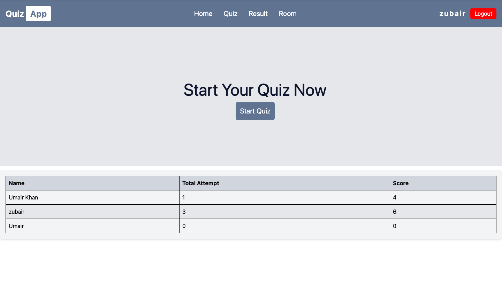
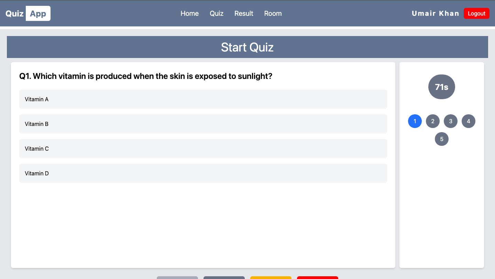

# 🎯 Quiz App

A full-stack Quiz Application where users can attempt quizzes, track their scores, and view their attempt history. The app enforces a maximum attempt limit to ensure fairness.

---

## 🚀 Features

- User authentication (Login/Signup)
- Start quiz with random questions
- Enforced **maximum of 5 attempts per user**
- Multiple choice questions with options
- Timer for each quiz session
- Track **score per attempt** and **last attempt score**
- View attempt history (attempt number, score, date)
- Toast notifications for success and errors
- Responsive and user-friendly UI
- Backend validation to prevent bypassing attempt limits
- Optional: Quiz Battle (real-time quiz using Socket.io)

---

## 🛠️ Tech Stack

### Frontend

- React.js
- React Router DOM
- Axios
- Tailwind CSS
- React Toastify (for notifications)

### Backend

- Node.js
- Express.js
- MongoDB with Mongoose
- Cookie-based authentication
- Custom error handling middleware
- Socket.io (For Room Quiz Handling)
- Jwt (For Secure Authentication)
- Bcrypt (For HashPassword)
- Cors (For Frontend Connection)

### Optional (if enabled)

- Socket.io (for real-time quiz battles)

---

## 📂 Project Structure

### Frontend (`/client`)

```pgsql
client/
│── src/
│ ├── components/
│ │ ├── Timer.jsx
│ │ └── Background.jsx
│ ├── pages/
│ │ ├── Quiz.jsx
│ │ ├── Result.jsx
│ │ └── Signup.jsx
│ ├── App.jsx
│ ├── main.jsx
│ └── styles/
│── package.json
```

# Backend (`/server`)

```pgsql
server/
│── models/
│ ├── UserModel.js
│ ├── QuizModel.js
│ └── ResultModel.js
│── routes/
│ ├── quizRoutes.js
│ └── authRoutes.js
│── middleware/
│ └── errorHandler.js
│── controllers/
│ ├── quizController.js
│ └── authController.js
│── server.js
│── package.json
```

---

# installation

### 1. CLone Repository

```bash
 git clone https://github.com/mrumairkhan74/quiz-app.git
 cd quiz-app

```

### 2. Setup Backend

```bash
cd backend
npm install
```

### Create Env file

```env
PORT=5000
MONGO_URI=your_connection_string
FRONTEND_URI=your_frontend_url
JWT_SECRET_KEY=your_secret_key
JWT_EXPIRY=30m
```

### Run Backend

```bash
 #up to you which command you want to run i added both init
npm run dev
npm run start
```

---

### 3. Setup Frontend

```bash
cd frontend
npm install
npm run dev
```

### env file for frontend

```env
VITE_BACKEND_URI=http://localhost:5000/api
```

---

## API EndPoint

### Authentication

- /user/login (post)
- /user/create (post)
- /user/logout (post)
- /user/me (get)
- /user/all (get)

### Quiz

- /quiz/start (get)
- /quiz/submit (post)
- /quiz/result (get) <!-- only logged in user get his result on result page  -->

### Room Api

<!-- get -->

- /room/all ( all rooms )
- /room/:id (room by id only joined user can open room)

<!-- Post -->

- /room/create (for create Room)
- /room/join/:id (for join room)
- /room/submit/:id (for submit answer & calculate answers)
- /room/start/:id (start quiz only creator can do)

<!-- delete -->

- /room/:id (only creator can delete room)

---

## Demo



[Live Demo](https://quiz-app-beta-gules.vercel.app/)

---

### backend Schema Model

```javascript
// UserModel
{
  name: String,
  email: String,
  password: String,
  rooms: [ObjectId],
  results: [ObjectId]
}

// RoomModel
{
  roomName: String,
  createdBy: ObjectId,
  players: [{ user: ObjectId, score: Number, completed: Boolean }],
  questions: [{ questionId, question, options, correctOption }],
  status: String // waiting | inprogress | completed
}
```

---

### Contribution
```markdown
## Contributing
Feel free to fork this repository, make changes, and submit pull requests. Ensure backend validation and frontend state management are properly handled.
```

---
### License
```markdown
## License
MIT License
```
---

```javascript
//Created By
{
name: Umair Khan
}
```
